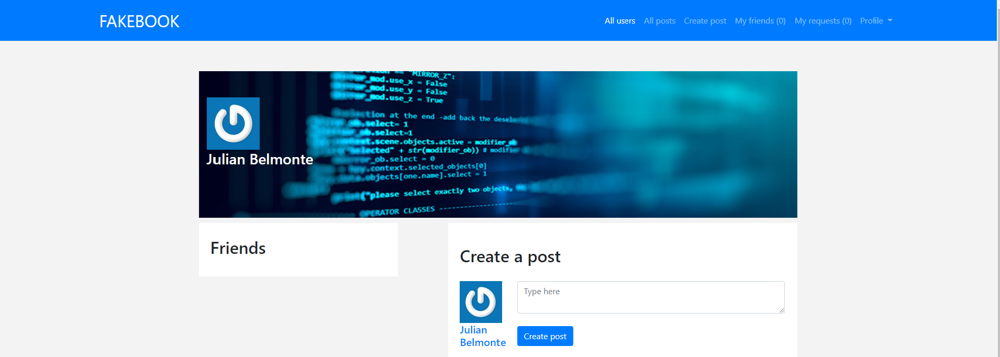

# Facebook Clone

In this project, we’ll be building a Facebook like application. We'll not focus on styling, but in the core functionalities - users, “friending”, posts, and “liking”. We’ll also implement "sign-in with Facebook" functionality with Omniauth. We'll also write some basic set of unit and integration tests to make sure the associations and the main visual elements have been properly made.

## Technologies

- Ruby on Rails
- PostgreSQL
- Bootstrap
- Omniauth
- RSpec/Capybara

# [Link to live version](https://fakebook-rails.herokuapp.com/)

## Functionalities

- Create an account
- Login
- Login with Facebook
- Create, update and delete a post
- Like a post or remove like from a post
- Create, update and delete comments
- Send a friend requests (or cancel a request sent)
- Accept / reject a friend request
- Delete a friend

## Authors

[Julian Belmonte](https://github.com/jucora) 
[Hugo Passos](https://github.com/hugopassos)
